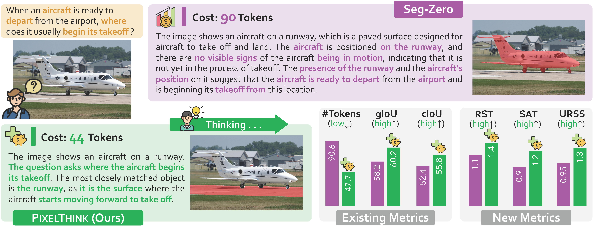

# PixelThink
> Song Wang, Gongfan Fang, Lingdong Kong, Xiangtai Li, Jianyun Xu, Sheng Yang, Qiang Li, Jianke Zhu, Xinchao Wang

This is the official implementation of **PixelThink: Towards Efficient Chain-of-Pixel Reasoning** (arXiv 2025)  [[Paper]()] [[Google Drive](https://drive.google.com/drive/folders/1gy-8IVfLnZB8hEqREewK6c8AQXR9awBp?usp=drive_link)].

## Abstract
Existing reasoning segmentation approaches typically fine-tune multimodal large language models (MLLMs) using image-text pairs and corresponding mask labels. However, they exhibit limited generalization to out-of-distribution scenarios without an explicit reasoning process. Although recent efforts leverage reinforcement learning through group-relative policy optimization (GRPO) to enhance reasoning ability, they often suffer from overthinking—producing uniformly verbose reasoning chains irrespective of task complexity. This results in elevated computational costs and limited control over reasoning quality. To address this problem, we propose PixelThink, a simple yet effective scheme that integrates externally estimated task difficulty and internally measured model uncertainty to regulate reasoning generation within a reinforcement learning paradigm. The model learns to compress reasoning length in accordance with scene complexity and predictive confidence. To support comprehensive evaluation, we introduce ReasonSeg-Diff, an extended benchmark with annotated reasoning references and difficulty scores, along with a suite of metrics designed to assess segmentation accuracy, reasoning quality, and efficiency jointly. Experimental results demonstrate that the proposed approach improves both reasoning efficiency and overall segmentation performance. Our work contributes novel perspectives towards efficient and interpretable multimodal understanding.

  

## Acknowledgement

We sincerely thank the developers of the following open-source projects for their valuable contributions: [Seg-Zero](https://github.com/dvlab-research/Seg-Zero), [verl](https://github.com/volcengine/verl), [Qwen2.5-VL](https://github.com/QwenLM/Qwen2.5-VL), [SAM2](https://github.com/facebookresearch/sam2), [L1](https://github.com/cmu-l3/l1)
